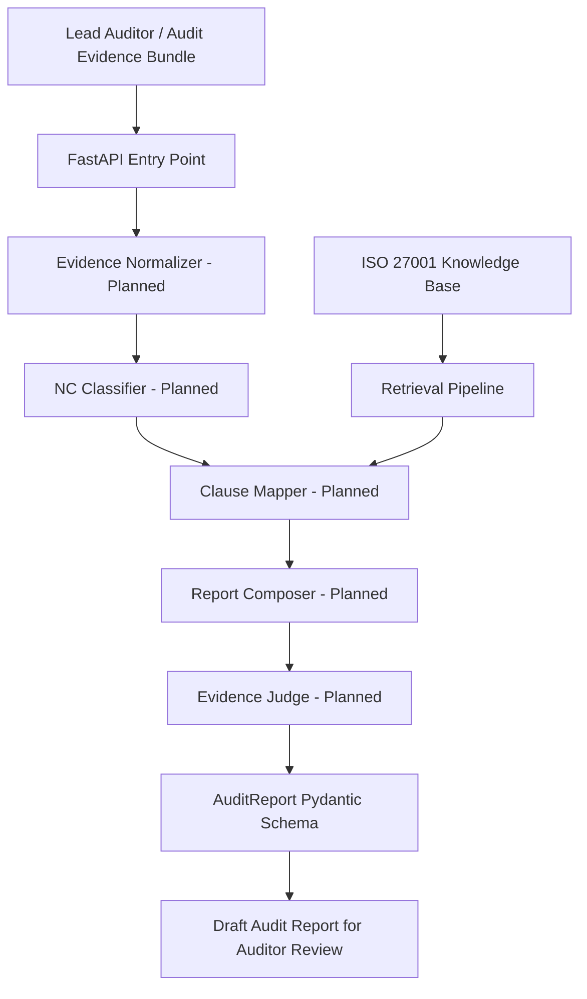

# ISO Audit Report Generator

An AI-enabled system designed to transform raw audit evidence into a structured draft audit report for ISO/IEC 27001:2022.

## Members

- Waramart Kumsatar
- Teeraphat Yodyotee
- Sasikan Saenchanta

## Status

**Iteration 1 – Walking Skeleton Completed**
**Iteration 2 – In Progress (Week 4 Knowledge Base Setup)**

## Architectural Summary

The ISO Audit Report Generator helps lead auditors transform raw audit notes, interview records, and checklist results into structured draft audit reports. The intended output includes an executive summary, classified findings, objective evidence, ISO clause references, and suggested corrective actions.

In Iteration 1, the project implements Pydantic schemas, an evidence-ingest FastAPI endpoint, structured request and response validation, sample input/output, and the planned system architecture. The current API uses an in-memory mock workflow and does not yet analyze evidence with an LLM.

Evidence normalization, finding classification, ISO clause mapping, report composition, RAG, and evidence judging are currently planned components. These components will be implemented progressively in Iteration 2. All generated reports are intended for auditor review and sign-off only.

## Problem and Solution

Lead auditors spend significant time converting raw notes, checklists, interview records, and document-review results into formal audit reports.

The ISO Audit Report Generator is designed to accept an audit evidence bundle and produce a structured draft report. The system will classify findings as Major NC, Minor NC, Observation, or OFI and ensure that each finding is grounded in objective evidence.

## Users and Primary Use Cases

- **Lead Auditor:** submits audit evidence and receives structured draft report sections.
- **Audit Manager:** reviews finding classifications and report content before client delivery.

Primary use case:

> A Lead Auditor submits an audit evidence bundle and receives a structured draft audit report for human review and sign-off.

## Scope

### In Scope

- ISO/IEC 27001:2022
- Audit evidence intake and normalization
- Audit observations
- Finding classification
- ISO clause and control mapping
- Objective evidence
- Corrective-action suggestions
- Executive summary and structured report generation
- Human review and auditor sign-off

### Out of Scope

- Issuing official audit certificates
- Audit scheduling and logistics
- On-site photo or video analysis
- Automatic publication of reports to clients

## Progress

- [x] Week 2: Audit Report Schemas
- [x] Week 3: Evidence Ingest API
- [x] Week 4: ISO 27001 Knowledge Base Setup
- [x] Week 5: RAG Retrieval Pipeline
- [ ] Week 6: NC Classifier Agent
- [ ] Week 7: Report Composer Agent
- [ ] Week 8: Evidence Judge Agent
- [ ] Week 9: Frontend UI
- [ ] Week 10: Report Viewer
- [ ] Week 11: Export PDF / Markdown
- [ ] Week 12: Evaluation & Demo Preparation

## System Architecture

The diagram below represents the planned target architecture. Components marked as planned are documented in Iteration 1 but are not implemented yet.



## Agent Responsibilities

| Agent / Component | Responsibility | Current Status |
|---|---|---|
| FastAPI Entry Point | Receive and validate audit evidence bundles | Implemented |
| Evidence Normalizer | Structure raw audit evidence into observations | Planned |
| NC Classifier | Classify findings as Major NC, Minor NC, Observation, or OFI | Planned |
| Clause Mapper | Map findings to ISO/IEC 27001:2022 clauses or controls | Planned |
| ISO 27001 Knowledge Base | Provide grounded requirement and control information | Implemented with local JSON data and Pydantic validation |
| Retrieval Pipeline | Rank relevant ISO knowledge for submitted evidence | Implemented with baseline lexical retrieval |
| Report Composer | Generate structured draft audit report sections | Planned |
| Evidence Judge | Verify that each finding is supported by objective evidence | Planned |
| AuditReport Schema | Validate the structure of the draft audit report | Implemented with mock data |

## ISO 27001 Knowledge Base

Week 4 implements a local ISO/IEC 27001:2022 knowledge base for development and testing.

The knowledge base includes:

- Structured control references and project-authored summaries
- Keywords for future retrieval
- Source notes requiring verification against an authorized ISO copy
- Pydantic validation through `KnowledgeDocument` and `KnowledgeBase`
- A reusable loader for the planned RAG retrieval pipeline

Validate the knowledge base from the repository root:

```powershell
py -m backend.test_knowledge_base
```

The current dataset is a development sample and does not replace an authorized copy of ISO/IEC 27001:2022.


## API Contract

| Method | Endpoint | Request Model | Response Model | Current Behavior |
|---|---|---|---|---|
| GET | `/` | None | Status message | Returns API status |
| POST | `/audits/ingest` | `AuditIngestRequest` | `AuditIngestResponse` | Validates and stores evidence in memory |
| POST | `/knowledge/search` | `RetrievalRequest` | `list[RetrievalResult]` | Returns ranked ISO knowledge documents |

The `POST /audits/ingest` endpoint uses FastAPI's `response_model` to validate the response against the `AuditIngestResponse` Pydantic model.

The `POST /knowledge/search` endpoint retrieves and ranks relevant ISO knowledge documents and validates the response against a list of `RetrievalResult` models.

## Pydantic Schemas

The project includes the following main report schemas:

- `AuditObservation`
- `AuditFinding`
- `AuditReport`
- `EvidenceItem`
- `AuditIngestRequest`
- `AuditIngestResponse`

The report schemas define the intended structured output of the future AI pipeline. The ingest schemas validate the request and response currently used by the FastAPI stub.

## Sample Input

The following request body can be submitted to `POST /audits/ingest`:

```json
{
  "org_name": "Acme Corp",
  "standard": "ISO/IEC 27001:2022",
  "evidence": [
    {
      "source": "interview",
      "raw_text": "No access review records were available during the audit."
    },
    {
      "source": "checklist",
      "raw_text": "Privileged user access review was not performed in the last 12 months."
    }
  ]
}
```

## Sample API Response

The following response is returned by `POST /audits/ingest` and validated by the `AuditIngestResponse` Pydantic model:

```json
{
  "audit_id": "example-generated-uuid",
  "org_name": "Acme Corp",
  "standard": "ISO/IEC 27001:2022",
  "evidence": [
    {
      "source": "interview",
      "raw_text": "No access review records were available during the audit."
    },
    {
      "source": "checklist",
      "raw_text": "Privileged user access review was not performed in the last 12 months."
    }
  ],
  "status": "ingested"
}
```

## Sample AuditReport Schema Output (Mock)

The following output is mock data defined in `backend/test_schemas.py`. It demonstrates that the intended `AuditReport` structure can be validated by Pydantic. It is not currently generated automatically from the ingest request.

```json
{
  "org_name": "Acme Corp",
  "audit_date": "2026-08-03",
  "standard": "ISO/IEC 27001:2022",
  "executive_summary": "The audit identified one major nonconformity related to access review.",
  "findings": [
    {
      "finding_id": "F-001",
      "clause_ref": "A.5.18",
      "classification": "major_nc",
      "finding_statement": "Access reviews were not performed.",
      "objective_evidence": [
        "Access reviews were not performed or documented."
      ],
      "requirement_text_id": "ISO27001-A.5.18",
      "suggested_corrective_action": "Establish and document periodic access reviews."
    }
  ],
  "open_questions": [
    "Confirm access review frequency."
  ],
  "disclaimer": "Draft report for auditor review and sign-off only."
}
```

## Repository Layout

```text
WorkProject-ISOAuditReportGenerator/
├── backend/
│   ├── models/
│   ├── app.py
│   └── test_schemas.py
├── data/
├── prompts/
├── reports/
├── static/
├── templates/
├── .env.example
├── .gitignore
├── README.md
└── requirements.txt
```

## How to Run

### 1. Create a virtual environment

```powershell
py -m venv .venv
```

### 2. Activate the virtual environment

```powershell
.\.venv\Scripts\Activate.ps1
```

If PowerShell blocks script execution, allow it for the current Terminal session:

```powershell
Set-ExecutionPolicy -Scope Process -ExecutionPolicy Bypass
.\.venv\Scripts\Activate.ps1
```

### 3. Install dependencies

```powershell
python -m pip install -r requirements.txt
```

### 4. Test the Pydantic report schemas

```powershell
python backend/test_schemas.py
```

Expected result: the Terminal displays a structured mock `AuditReport` JSON response without errors.

### 5. Start the FastAPI server

```powershell
python -m uvicorn backend.app:app --reload
```

### 6. Open the application

- API status: http://127.0.0.1:8000
- Swagger UI: http://127.0.0.1:8000/docs

Use Swagger UI to test `POST /audits/ingest` with the sample request shown above.

## Iteration 1 Demo Flow

1. Run `backend/test_schemas.py` to validate the mock `AuditReport`.
2. Start the FastAPI server.
3. Open Swagger UI at `/docs`.
4. Submit the sample evidence bundle to `POST /audits/ingest`.
5. Confirm that the endpoint returns HTTP `200`.
6. Confirm that the response matches the `AuditIngestResponse` Pydantic schema.
7. Review the planned architecture and deferred AI components.

## Known Limitations

- The current `/audits/ingest` endpoint stores evidence in an in-memory dictionary.
- Stored data is lost when the FastAPI server restarts.
- The endpoint does not yet transform evidence into an `AuditReport`.
- The `AuditReport` shown in `test_schemas.py` is mock data.
- Evidence Normalizer, NC Classifier, Clause Mapper, Report Composer, and Evidence Judge are not yet implemented.
- Real LLM, RAG, ISO Knowledge Base retrieval, UI, and evaluation are deferred.

## Design Foresight and Next Iterations

### Iteration 2 – AI Core (`v0.2.0`)

Planned work:

1. Prepare the ISO/IEC 27001:2022 Knowledge Base.
2. Implement document ingestion, chunking, and retrieval.
3. Connect an LLM with structured Pydantic output.
4. Implement evidence normalization.
5. Implement finding classification.
6. Implement ISO clause mapping.
7. Implement report composition.
8. Implement the Evidence Judge and grounding checks.
9. Evaluate the system using a gold subset and defined metrics.

### Iteration 3 – Product and Demo (`v1.0.0`)

Planned work:

- Frontend and report-review UI
- Human review and auditor sign-off workflow
- Report viewer
- PDF and Markdown export
- Security guardrails
- Full gold-set evaluation
- Demo preparation and demo video

## Security and Human Review

- Audit evidence must be treated as untrusted input.
- Secrets and API keys must never be committed to GitHub.
- Environment-variable names are documented in `.env.example`.
- Generated reports must never be automatically published to clients.
- Every generated report is a draft for auditor review and sign-off only.

## Release

Iteration 1 is published as GitHub Release `v0.1.0`.

The release includes:

- Pydantic schemas
- FastAPI evidence-ingest stub
- Valid Pydantic request and response models
- Sample input and structured output
- System architecture diagram
- Release notes

## Disclaimer

This project currently produces mock and draft outputs for educational development and testing. All audit findings and reports require review and sign-off by a qualified auditor before use.