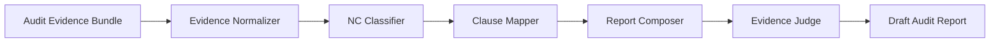

# ISO Audit Report Generator

AI PROJECT FOR GENERATING ISO AUDIT REPORTS.

## Members

- Waramart Kumsatar
- Teeraphat Yodyotee
- Sasikan Saenchanta

## Status

Iteration 1 – Walking Skeleton Completed

## Progress

- [x] Week 2: Audit Report Schemas 
- [x] Week 3: Evidence Ingest API 
- [ ] Week 4: ISO 27001 Knowledge Base Setup 
- [ ] Week 5: RAG Retrieval Pipeline 
- [ ] Week 6: NC Classifier Agent 
- [ ] Week 7: Report Composer Agent 
- [ ] Week 8: Evidence Judge Agent 
- [ ] Week 9: Frontend UI 
- [ ] Week 10: Report Viewer 
- [ ] Week 11: Export PDF / Markdown 
- [ ] Week 12: Evaluation & Demo Preparation 


## System Architecture




## Agent Responsibilities

| Agent | Responsibility |
|---|---|
| Evidence Normalizer | Structure raw audit evidence into observations |
| NC Classifier | Classify findings as Major NC, Minor NC, Observation, or OFI |
| Clause Mapper | Map findings to ISO/IEC 27001:2022 clauses or controls |
| Report Composer | Generate structured draft audit report sections |
| Evidence Judge | Verify that each finding is supported by objective evidence |

## Sample Input

```json
{
  "org_name": "Acme Corp",
  "standard": "ISO/IEC 27001:2022",
  "evidence": [
    {
      "source": "interview",
      "raw_text": "No access review records were available during the audit."
    },
    {
      "source": "checklist",
      "raw_text": "Privileged user access review was not performed in the last 12 months."
    }
  ]
}
```

## Sample Structured Output

```json
{
  "org_name": "Acme Corp",
  "audit_date": "2026-08-03",
  "standard": "ISO/IEC 27001:2022",
  "executive_summary": "The audit identified one major nonconformity related to access review.",
  "findings": [
    {
      "finding_id": "F-001",
      "clause_ref": "A.5.18",
      "classification": "major_nc",
      "finding_statement": "Access reviews were not performed.",
      "objective_evidence": [
        "Access reviews were not performed or documented."
      ],
      "requirement_text_id": "ISO27001-A.5.18",
      "suggested_corrective_action": "Establish and document periodic access reviews."
    }
  ],
  "open_questions": [
    "Confirm access review frequency."
  ],
  "disclaimer": "Draft report for auditor review and sign-off only."
}
```