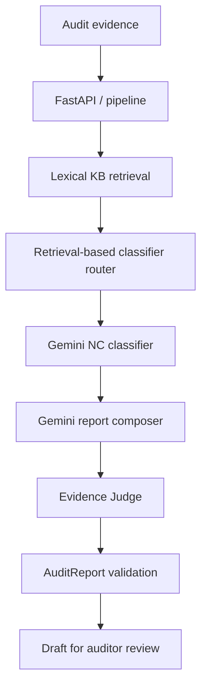

# ISO Audit Report Generator

An AI-enabled system that transforms raw audit evidence into structured draft audit reports for ISO/IEC 27001:2022. Every generated report requires auditor review and sign-off.

## Members

- Waramart Kumsatar
- Teeraphat Yodyotee
- Sasikan Saenchanta

## Project status

- **Iteration 1 — Walking Skeleton:** released as `v0.1.0`
- **Iteration 2 — AI Core:** completed and evaluated
- **Iteration 3 — Demo Day Product:** planned

## Problem and solution

Lead auditors spend significant time converting raw notes, checklists, interview records, and document-review results into formal findings reports. This project accepts a text evidence bundle and produces a Pydantic-validated draft report containing:

- an executive summary;
- findings classified as `major_nc`, `minor_nc`, `observation`, or `ofi`;
- ISO clause and knowledge-document references;
- objective evidence;
- suggested corrective actions; and
- questions requiring human review.

The system never issues a certification decision or publishes a report automatically.

## Users and primary use cases

- **Lead auditor:** submits audit evidence and receives structured draft report sections.
- **Audit manager:** reviews classifications and report content before client delivery.

The primary use case is a lead auditor submitting an evidence bundle and receiving a structured draft report for human review and sign-off.

## Scope

### In scope

- ISO/IEC 27001:2022 evidence and requirement references
- Text evidence intake for report generation
- Finding classification and clause mapping
- Objective-evidence grounding
- Corrective-action suggestions
- Executive-summary and report generation
- Human review and auditor sign-off

### Out of scope

- Issuing official audit certificates or compliance verdicts
- Audit scheduling and logistics
- On-site photo or video analysis
- Automatic publication to clients

## Current architecture



The classifier router chooses a management-system, Annex A, or mixed specialist instruction path from retrieved ISO references. The Evidence Judge combines deterministic evidence/reference checks with a structured Gemini judgment. A report that fails the Judge is blocked from the public pipeline response and marked `needs_revision`.

## Components

| Component | Responsibility | Status |
| --- | --- | --- |
| FastAPI | Validate requests and expose system endpoints | Implemented |
| ISO knowledge base | Store project-authored ISO 27001 summaries and reference IDs | Implemented |
| Retrieval pipeline | Rank relevant knowledge documents using lexical retrieval | Implemented |
| Classifier router | Select a specialist instruction path from retrieved references | Implemented |
| NC Classifier | Classify evidence and return grounded structured output | Implemented |
| Report Composer | Generate a Pydantic-validated `AuditReport` | Implemented |
| Evidence Judge | Check evidence support and reference validity | Implemented |
| Evaluation runner | Compare pipeline outputs with authored Gold labels | Implemented |
| Evidence Normalizer | Create explicit `AuditObservation` objects | Planned |
| Dedicated Clause Mapper | Separate clause mapping from classification | Planned |
| Report review UI and export | Human review and PDF/Markdown delivery | Planned for Iteration 3 |

## Progress

- [x] Week 2: Audit report schemas
- [x] Week 3: Evidence ingest API
- [x] Week 4: ISO 27001 knowledge base setup
- [x] Week 5: Retrieval pipeline
- [x] Week 6: NC Classifier and retrieval-based router
- [x] Week 7: Report Composer and end-to-end pipeline
- [x] Week 8: Evidence Judge and Gold-set evaluation
- [ ] Weeks 9–12: UI, report review, security guardrails, prompt versioning, and export

## API endpoints

| Method | Endpoint | Behavior |
| --- | --- | --- |
| `GET` | `/` | Return API status |
| `POST` | `/audits/ingest` | Validate and store an evidence bundle in memory |
| `POST` | `/knowledge/search` | Return ranked ISO knowledge documents |
| `POST` | `/findings/classify` | Retrieve context and classify one evidence item |
| `POST` | `/reports/compose` | Compose a structured draft report |
| `POST` | `/reports/judge` | Judge report findings against evidence and KB references |
| `POST` | `/reports/run` | Run composition and Judge gating end to end |

Interactive API documentation is available at `http://127.0.0.1:8000/docs` while the server is running.

## Pydantic schemas

The main report and pipeline models include:

- `AuditObservation`
- `AuditFinding`
- `AuditReport`
- `AuditIngestRequest` and `AuditIngestResponse`
- `ClassificationRequest` and `ClassificationResult`
- `ReportComposeRequest`
- `EvidenceJudgeRequest` and `EvidenceJudgeResponse`
- `PipelineResponse`
- `GoldFinding` and `GoldDataset`

Structured Gemini responses are validated before they are returned or scored.

## Sample ingest request

Submit the following body to `POST /audits/ingest`:

```json
{
  "org_name": "Acme Corp",
  "standard": "ISO/IEC 27001:2022",
  "evidence": [
    {
      "source": "interview",
      "raw_text": "No access review records were available during the audit."
    },
    {
      "source": "checklist",
      "raw_text": "Privileged user access review was not performed in the last 12 months."
    }
  ]
}
```

The endpoint validates and stores the evidence in memory, returning an `AuditIngestResponse` containing the generated `audit_id`, submitted fields, and `status: ingested`.

## Sample structured report

The report pipeline returns the following shape. The content below is abbreviated example data; live content is generated and validated at runtime.

```json
{
  "org_name": "Acme Corp",
  "audit_date": "2026-09-10",
  "standard": "ISO/IEC 27001:2022",
  "executive_summary": "Draft summary for auditor review.",
  "findings": [
    {
      "finding_id": "F-001",
      "clause_ref": "A.5.18",
      "classification": "minor_nc",
      "finding_statement": "A periodic privileged-access review was not performed.",
      "objective_evidence": [
        "Privileged user access review was not performed in the last 12 months."
      ],
      "requirement_text_id": "ISO27001-A.5.18",
      "suggested_corrective_action": "Define and document a periodic access-review process."
    }
  ],
  "open_questions": [],
  "disclaimer": "Draft report for auditor review and sign-off only."
}
```

## Knowledge base and evaluation data

The project uses:

- project-authored summaries for selected ISO/IEC 27001:2022 clauses and Annex A controls;
- an instructor-approved sample ISO 27001 gap-analysis report as the source for paraphrased development cases;
- 10 synthetic, independently runnable evidence cases;
- authored reference labels and clause/document pairs in `data/evaluation/gold.json`; and
- Pydantic validation that checks input/Gold alignment and verifies every Gold reference exists in the KB.

The repository does not redistribute the complete ISO standard. The Gold annotations currently have `review_status: draft`; they are development references requiring team or instructor review and are not presented as instructor-verified labels.

### RAG/KB sources

- `data/knowledge_base/iso27001_controls.json`: project-authored requirement summaries and reference IDs used for retrieval
- Instructor-approved ISO 27001 gap-analysis sample report: source for the paraphrased development evidence cases
- Authorized ISO/IEC 27001:2022 and ISO/IEC 27002:2022 excerpts/references: used to review requirement and control references during development

## Iteration 2 evaluation

A completed run evaluated all 10 cases with Gemini 3.6 Flash.

| Metric | Result |
| --- | ---: |
| Pipeline coverage | 10/10 (100%) |
| Classification accuracy | 8/10 (80%) |
| Classification macro F1 | 81.25% |
| Exact clause + requirement ID accuracy | 100% |
| Automated grounding score | 100% |
| Automated unsupported finding rate | 0% |
| Automated unsupported major findings | 0 |

`GAP-007` and `GAP-010` were predicted as `minor_nc` while the draft Gold labels are `observation`. These disagreements remain visible in the evaluation report rather than changing Gold labels to match model output.

The scores are development results on authored cases, not a held-out benchmark. Judge metrics are automated checks and do not replace qualified auditor review. See the checked-in Iteration 2 `eval_report.md` for denominators and per-case results.

## Repository layout

The local `.env`, virtual environment, Python caches, and timestamped evaluation
runs are intentionally omitted from this repository view.

```text
ISOAuditReportGenerator/
├── backend/
│   ├── agents/
│   │   ├── __init__.py
│   │   ├── classifier_router.py
│   │   ├── evidence_judge.py
│   │   ├── nc_classifier.py
│   │   └── report_composer.py
│   ├── models/
│   │   ├── classification.py
│   │   ├── evaluation.py
│   │   ├── evidence_judgment.py
│   │   ├── knowledge_base.py
│   │   ├── pipeline.py
│   │   ├── report_composition.py
│   │   ├── retrieval.py
│   │   └── schemas.py
│   ├── services/
│   │   ├── __init__.py
│   │   ├── evaluation_data.py
│   │   ├── evaluation_metrics.py
│   │   ├── gemini_client.py
│   │   ├── knowledge_base.py
│   │   ├── pipeline.py
│   │   └── retrieval.py
│   ├── app.py
│   ├── evaluate.py
│   ├── setup_iteration2_kb.py
│   ├── test_classifier.py
│   ├── test_classifier_router.py
│   ├── test_evaluation_data.py
│   ├── test_evaluation_metrics.py
│   ├── test_evaluation_runner.py
│   ├── test_evidence_judge.py
│   ├── test_knowledge_base.py
│   ├── test_report_composer.py
│   ├── test_retrieval.py
│   └── test_schemas.py
├── data/
│   ├── evaluation/
│   │   ├── gold.json
│   │   └── inputs.json
│   ├── knowledge_base/
│   │   └── iso27001_controls.json
│   └── .gitkeep
├── prompts/
│   └── .gitkeep
├── reports/
│   ├── iteration2/
│   │   └── eval_report.md
│   └── .gitkeep
├── static/
│   └── .gitkeep
├── templates/
│   └── .gitkeep
├── .env.example
├── .gitignore
├── README.md
└── requirements.txt
```

`reports/evaluation/<run-id>/` is generated locally for timestamped raw run
artifacts. The stable `reports/iteration2/eval_report.md` is the report selected
for the Iteration 2 release.

## Setup

Python 3.10 or newer is required.

```powershell
py -m venv .venv
.\.venv\Scripts\Activate.ps1
python -m pip install -r requirements.txt
```

Create a local `.env` file from `.env.example` and configure the required values:

```dotenv
GOOGLE_API_KEY=your_api_key_here
GEMINI_MODEL=gemini-3.6-flash
GEMINI_TIMEOUT_SECONDS=120
```

Never commit `.env` or API keys.

## Validate and run

Initialize/extend the development knowledge base, then run its validation and retrieval tests:

```powershell
python -m backend.setup_iteration2_kb
python -m backend.test_knowledge_base
python -m backend.test_retrieval
```

Run the offline validations and tests:

```powershell
python -m compileall -q backend
python -m backend.test_schemas
python -m backend.test_classifier_router
python -m backend.test_evaluation_data
python -m unittest backend.test_evaluation_metrics backend.test_evaluation_runner
```

The classifier, composer, Judge, and full evaluation commands make real Gemini
API calls and therefore use the configured project's quota.

Start FastAPI:

```powershell
python -m uvicorn backend.app:app --reload
```

## Run the evaluation

Validate the evaluation data without making API calls:

```powershell
python -m backend.evaluate --dry-run
```

Run a smoke test on the first case:

```powershell
python -m backend.evaluate --limit 1
```

Run all cases:

```powershell
python -m backend.evaluate
```

Each run writes `results.json`, `gold_reports.json`, and `eval_report.md` under `reports/evaluation/<run-id>/`. Interrupted, timed-out, and rate-limited cases remain visible; missing predictions stay in the metric denominator. A saved run can continue pending or failed cases:

```powershell
python -m backend.evaluate --resume ".\reports\evaluation\<run-id>"
```

Gemini Free Tier quotas may require the evaluation to continue later. The runner preserves completed cases and stops when it detects a rate-limit error.

## Security and human review

- Treat submitted evidence as untrusted input.
- Keep API keys in local environment variables.
- Do not redistribute full licensed ISO documents.
- Do not present generated content as an official certification verdict.
- Do not automatically publish generated reports to clients.
- Require a qualified auditor to review and sign off every report.

## Known limitations

- Gold labels remain draft pending expert review.
- Retrieval is a lexical baseline rather than vector/embedding retrieval.
- The ingest store is in memory and resets with the API process.
- Evidence normalization and clause mapping are not yet separate agents.
- The current evaluation set is small and development-authored.
- The UI, override audit trail, prompt registry, security test pack, and report export are planned for Iteration 3.

## Iteration history and roadmap

### Iteration 1 — `v0.1.0`

The walking skeleton established the Pydantic schemas, evidence-ingest API, sample input/output, repository structure, architecture diagram, and FastAPI documentation. Its demo flow validated a mock `AuditReport`, started FastAPI, submitted evidence through Swagger UI, and confirmed the structured response.

### Iteration 2 — `v0.2.0`

The AI core adds the knowledge base, lexical retrieval, classifier router, real structured Gemini calls, Report Composer, Evidence Judge, end-to-end report gating, development Gold data, evaluation runner, and metrics report.

### Iteration 3 — `v1.0.0`

Planned work includes the report-review UI, auditor overrides and audit trail, security tests and guardrails, prompt versioning, PDF/Markdown export, full reviewed Gold evaluation, demo script, and demo video.

## Releases

- `v0.1.0`: Iteration 1 walking skeleton
- `v0.2.0`: Iteration 2 AI core
- `v1.0.0`: Demo Day product (planned)

## Disclaimer

This educational project produces draft audit content only. All findings, classifications, corrective-action suggestions, and reports require review and sign-off by a qualified auditor before use.