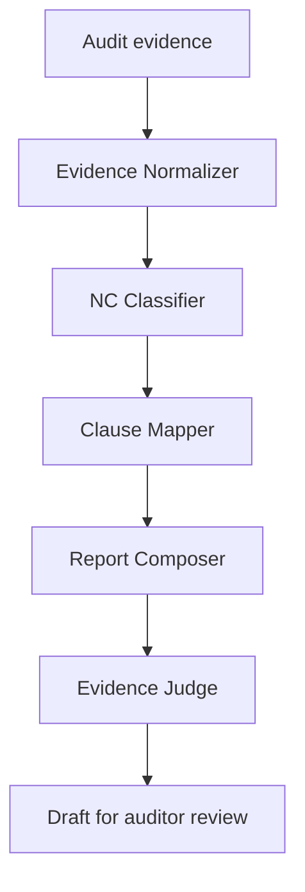

# ISO Audit Report Generator

An AI-assisted system that transforms ISO/IEC 27001:2022 audit evidence into
structured draft reports with classified, clause-mapped, and evidence-grounded
findings.

> **v1.0.0 — Iteration 3 Demo Day**  
> Start with [START_HERE_TH.md](START_HERE_TH.md) for Thai installation,
> testing, and demonstration instructions.

Every generated report is a draft that requires auditor review and sign-off.
The system does not issue certificates or publish reports automatically.

## Project status

| Iteration | Release | Result |
| --- | --- | --- |
| Iteration 1 — Walking Skeleton | `v0.1.0` | Released |
| Iteration 2 — AI Core | `v0.2.0` | Completed and evaluated |
| Iteration 3 — Demo Day Product | `v1.0.0` | Completed and validated |

## Members

- Waramart Kumsatar
- Teeraphat Yodyotee
- Sasikan Saenchanta

## Problem and solution

Lead auditors spend significant time converting raw notes, checklists,
interview records, and document-review results into formal findings reports.
This project accepts an audit evidence bundle and generates a
Pydantic-validated draft containing:

- an executive summary;
- findings classified as `major_nc`, `minor_nc`, `observation`, or `ofi`;
- ISO clause and requirement-document references;
- preserved objective evidence;
- suggested corrective actions; and
- open questions requiring human review.

### Primary users

- **Lead auditor:** uploads evidence and receives structured draft sections.
- **Audit manager:** reviews classifications and report content before client
  delivery.

### Scope

**In scope**

- ISO/IEC 27001:2022 evidence and requirement references
- Text evidence from interviews, checklists, and document reviews
- Evidence normalization, finding classification, and clause mapping
- Executive summary, finding statement, and corrective-action generation
- Evidence Judge gating and human review
- JSON and selectable-text PDF import
- English and Thai report output
- Markdown export and browser Print / Save as PDF

**Out of scope**

- Issuing official certificates or final compliance verdicts
- Audit scheduling and logistics
- On-site photo or video analysis
- OCR for scanned PDFs
- Automatic publication to clients

## v1.0.0 release highlights

### Review workspace and UI

- Operations dashboard showing Major/Minor NC totals, review workload, finding
  distribution, and recent audits
- New Audit workflow with JSON and selectable-text PDF import
- Dedicated audit library, reports, and evaluation/control views
- Persistent English/Thai interface selector
- English or Thai generated report narrative
- Original objective evidence plus an optional Thai reader-aid translation
- Auditor edits with reviewer, reason, timestamp, revision checks, and
  before/after history
- Explicit auditor-review acknowledgement

### AI pipeline and controls

- Five explicit stages: Evidence Normalizer, NC Classifier, Clause Mapper,
  Report Composer, and Evidence Judge
- Lexical retrieval over project-authored ISO requirement summaries
- Pydantic validation for requests, AI responses, reports, and Gold data
- Evidence Judge gate that hides unsupported drafts from the public pipeline
  response
- One-click Judge Block Demo for an intentionally unsupported claim
- Versioned safety policy and classification rubric
- Optional basic contact masking and safe text rendering

### Evaluation and release evidence

- 10 synthetic Acme evaluation cases covering interview, checklist, and document-review evidence, with one evidence item and one expected finding per case
- 10 separately authored full Gold reports
- Final 10-case evaluation with no missing predictions or errors
- 38/38 backend unit/API tests and 12/12 frontend logic/PDF tests passed
- Stable evaluation, validation, and hallucination-mitigation reports

Useful release documents:

- [Final evaluation](reports/v1.0/final_eval_report.md)
- [Judge and hallucination-mitigation log](reports/v1.0/judge_hallucination_log.md)
- [Validation report](reports/v1.0/validation_report.md)
- [Code-quality notes](docs/CODE_QUALITY.md)
- [PRD compliance matrix](docs/PRD_COMPLIANCE_MATRIX.md)
- [Gold review checklist](docs/INSTRUCTOR_GOLD_REVIEW.md)
- [Demo script](docs/DEMO_SCRIPT.md)
- [Release checklist](docs/RELEASE_CHECKLIST.md)
- [Changelog](CHANGELOG.md)

## Architecture



The normalizer creates traceable `AuditObservation` objects while preserving
the source text. Retrieval supplies relevant ISO candidates. The classifier
determines severity, the Clause Mapper selects a grounded clause/document pair,
and the Report Composer creates the formal finding. The Evidence Judge combines
deterministic checks with a structured Gemini judgment. Unsupported reports are
marked `needs_revision` and withheld from the public pipeline response.

| Component | Responsibility |
| --- | --- |
| Evidence Normalizer | Structure raw evidence without replacing its source text |
| Retrieval | Rank relevant project-authored ISO summaries |
| NC Classifier | Classify Major NC, Minor NC, Observation, or OFI |
| Clause Mapper | Select an allowed clause and requirement-document pair |
| Report Composer | Generate the executive summary and formal findings |
| Evidence Judge | Check evidence support and reference validity |
| Review API | Store, edit, review, and retrieve audit drafts and history |
| Evaluation runner | Compare predictions with the authored Gold set |

## Prompt versioning and security guardrails

- `prompts/safety-v1.txt` is prepended to AI prompts through the prompt
  registry.
- The final classifier uses classification rubric `v2`.
- Prompt-builder hashes identify the exact prompt implementation used in an
  evaluation run.
- Evidence is treated as untrusted input; embedded instructions are explicitly
  rejected by the prompt policy.
- API keys remain in local environment variables and are never committed.
- Provider failures are converted into safe HTTP responses without exposing
  provider details.
- All reports retain a draft disclaimer and require human review.
- Auditor edits create an append-only before/after history.

The bundled Judge Block Demo deliberately submits a report whose claim is
broader than its evidence. A correct result is `Report Grounded: No`,
`Overall Result: Unsupported`, and `Human Review Required: Yes`.

## Gold-set evaluation: Iteration 2 vs Iteration 3

Both releases completed all 10 authored development cases. The final Iteration
3 run used Gemini 3.5 Flash Lite, classification rubric v2, PRD-aligned Acme
evidence packs, and separately authored full Gold reports.

| Metric | Iteration 2 | Iteration 3 final | Change |
| --- | ---: | ---: | ---: |
| Evaluated cases | 10/10 | 10/10 | — |
| Prediction coverage | 100% | 100% | Unchanged |
| Classification accuracy | 80% | 100% | +20 percentage points |
| Classification macro F1 | 81.25% | 100% | +18.75 percentage points |
| Exact clause + requirement ID accuracy | 100% | 100% | Unchanged |
| Automated grounding score | 100% | 100% | Unchanged |
| Automated unsupported finding rate | 0% | 0% | Unchanged |
| Released unsupported Major NC count | 0 | 0 | Unchanged |

The PRD pass threshold requires:

- classification macro F1 of at least **75%**; and
- **zero** unsupported Major NCs on the gold set.

The final Iteration 3 run passed both requirements. Accuracy increased from 80%
to 100%, while macro F1 increased from 81.25% to 100%.

These are development results rather than a held-out benchmark. Iteration 3
also revised the dataset and Gold reports into the stricter PRD-aligned Acme
format and advanced their status from `draft` to `development_reviewed`.
Because the dataset and Gold reports changed between iterations, these
scores describe each release on its respective development dataset.
They are not a controlled comparison and do not establish how much
the model or pipeline alone improved.

See the [Iteration 2 report](reports/iteration2/eval_report.md), the
[intermediate Iteration 3 report](reports/iteration3/eval_report.md), and the
[final Iteration 3 report](reports/v1.0/final_eval_report.md).

## Model choice and result interpretation

The final build uses `gemini-3.5-flash-lite` for structured classification,
report composition, and evidence judgment. It was selected as the release
configuration used for the completed v1.0.0 evaluation. The comparison above
is a system-level evaluation: prompt rubric, agent responsibilities, dataset,
Gold reports, and validation controls changed alongside the model
configuration. It is not an isolated model benchmark.

Judge scores are automated proxies for grounding and do not constitute an ISO
certification decision or independent auditor confirmation.

## Evaluation data and knowledge base

The project includes:

- `data/evaluation/inputs.json`: 10 PRD-aligned Acme evidence cases;
- `data/evaluation/gold.json`: authored reference classifications and
  clause/document pairs;
- separately authored full Gold `AuditReport` references;
- `data/knowledge_base/iso27001_controls.json`: project-authored ISO requirement
  summaries and reference IDs; and
- Pydantic checks for input/Gold alignment and knowledge-base references.

The repository does not redistribute the complete ISO standard. Gold reports
have `review_status: development_reviewed`; they are not presented as
instructor-verified labels.

## API endpoints

| Method | Endpoint | Behavior |
| --- | --- | --- |
| `GET` | `/` | Return API status |
| `POST` | `/audits/ingest` | Validate an evidence bundle |
| `POST` | `/knowledge/search` | Retrieve ranked ISO references |
| `POST` | `/findings/classify` | Classify one evidence item |
| `POST` | `/reports/compose` | Compose a structured draft report |
| `POST` | `/reports/judge` | Judge findings against evidence and references |
| `POST` | `/reports/run` | Run the complete gated pipeline |
| `POST` | `/demo/judge-block` | Run the unsupported-claim guardrail demo |
| `POST` | `/audits` | Save a validated evidence bundle locally |
| `GET` | `/audits` | List saved audit drafts |
| `POST` | `/audits/{id}/generate` | Generate and store a gated report |
| `GET` | `/audits/{id}/report` | Retrieve a saved audit and report |
| `GET` | `/audits/{id}/history` | Retrieve append-only change history |
| `PATCH` | `/audits/{id}/findings/{fid}` | Save an auditor edit |
| `POST` | `/audits/{id}/review` | Record auditor review acknowledgement |
| `POST` | `/evaluate` | Validate or run the Gold-set evaluation |

Interactive API documentation is available at
`http://127.0.0.1:8000/docs` while FastAPI is running.

## Example input and output

Example request for `POST /audits/ingest`:

```json
{
  "org_name": "Acme Corp",
  "audit_date": "2026-09-16",
  "standard": "ISO/IEC 27001:2022",
  "report_language": "en",
  "evidence": [
    {
      "source": "interview",
      "raw_text": "No access review records were available during the audit."
    },
    {
      "source": "checklist",
      "raw_text": "Privileged access reviews were not completed on schedule."
    }
  ],
  "top_k": 3
}
```

Simplified generated finding:

```json
{
  "finding_id": "F-001",
  "clause_ref": "A.5.18",
  "classification": "minor_nc",
  "finding_statement": "Privileged access reviews were not completed according to the defined schedule.",
  "objective_evidence": [
    "No access review records were available during the audit."
  ],
  "requirement_text_id": "ISO27001-A.5.18",
  "suggested_corrective_action": "Define and document a periodic access-review process."
}
```

## Repository layout

```text
ISOAuditReportGenerator/
├── .github/workflows/       # Continuous integration
├── backend/
│   ├── agents/              # Normalize, classify, map, compose, judge
│   ├── models/              # Pydantic request/response schemas
│   ├── services/            # Pipeline, retrieval, storage, prompts, metrics
│   ├── app.py               # FastAPI application
│   ├── review_api.py        # Saved-audit and human-review endpoints
│   ├── evaluate.py          # Gold-set evaluation runner
│   └── test_*.py            # Backend unit and API tests
├── data/
│   ├── demo/                # Synthetic demonstration fixtures
│   ├── evaluation/          # Inputs, Gold labels, and Gold reports
│   ├── knowledge_base/      # Project-authored ISO summaries
│   └── report_templates/    # Report structure and tone references
├── frontend/
│   ├── src/                 # UI, API, review, export, PDF, and i18n modules
│   ├── tests/               # Frontend tests
│   ├── package.json
│   └── vite.config.js
├── prompts/                 # Versioned safety policy and rubric
├── reports/
│   ├── iteration2/          # Historical baseline
│   ├── iteration3/          # Intermediate comparison and security log
│   └── v1.0/                # Final metrics, validation, and Judge log
├── docs/                    # Demo, release, quality, and PRD evidence
├── .env.example
├── .gitignore
├── CHANGELOG.md
├── README.md
├── START_HERE_TH.md
├── requirements-dev.txt
└── requirements.txt
```

Local `.env`, virtual environments, Python caches, `frontend/node_modules`,
`frontend/dist`, `reports/local`, and timestamped `reports/evaluation` runs are
excluded from Git.

## Setup

Python 3.10 or newer is required. Node.js 20.19 or newer (or Node.js 22.12 or
newer) is required for the frontend.

```powershell
py -m venv .venv
.\.venv\Scripts\Activate.ps1
python -m pip install -r requirements-dev.txt
Copy-Item .env.example .env
```

Edit `.env` and add the local configuration:

```dotenv
GOOGLE_API_KEY=your_api_key_here
GEMINI_MODEL=gemini-3.5-flash-lite
GEMINI_TIMEOUT_SECONDS=120
```

Never commit `.env` or API keys.

### Start the backend

```powershell
python -m uvicorn backend.app:app --reload
```

### Start the frontend

Open a second terminal:

```powershell
cd frontend
npm ci
npm run dev
```

Open `http://localhost:5173`. Vite forwards `/api` requests to FastAPI at
`http://127.0.0.1:8000` during local development.

## Validation and tests

Run all backend checks:

```powershell
python -m compileall -q backend
python -m unittest discover -s backend -p "test_*.py"
python -m backend.evaluate --dry-run
```

Run frontend checks:

```powershell
cd frontend
npm ci
npm test
npm run check
npm run build
```

Commands that invoke Gemini require a configured API key and consume provider
quota. Offline unit tests and `--dry-run` do not require live model calls.

## Run the full evaluation

```powershell
python -m backend.evaluate
```

Run one case first when checking the live configuration:

```powershell
python -m backend.evaluate --limit 1
```

Resume an interrupted or rate-limited run:

```powershell
python -m backend.evaluate --resume ".\reports\evaluation\<run-id>"
```

Each run writes `results.json`, `gold_reports.json`, and `eval_report.md` under
`reports/evaluation/<run-id>/`. These timestamped raw runs remain local; stable
release reports are stored under `reports/iteration2`, `reports/iteration3`, and
`reports/v1.0`.

## Security and human-review boundary

- Use synthetic or de-identified evidence in this classroom build.
- Treat all submitted evidence as untrusted input.
- Keep API keys in `.env` and never commit them.
- Do not redistribute complete licensed ISO standard text.
- Never represent a generated report as a certification decision.
- Never automatically publish a generated report to a client.
- Require a qualified auditor to review every report before use.

## Known limitations

- The 10-case evaluation set is small, project-authored, and not held out.
- Gold reports remain `development_reviewed` until an instructor or qualified
  auditor signs them off.
- Retrieval is a lexical baseline rather than embedding/vector retrieval.
- Normalization structures and preserves evidence; it does not independently
  reinterpret the source.
- Clause mapping is a deterministic retrieved-context mapper/guard rather than
  another generative model call.
- Local SQLite evidence and history are plaintext; this classroom build has no
  authentication or multi-user authorization.
- Reviewer names are self-declared.
- Contact masking is best-effort and does not detect every form of PII.
- PDF import accepts selectable text only, up to 5 MB, 25 pages, and 9,500
  extracted characters. Scanned documents require OCR and are rejected.
- Thai report mode localizes generated narrative. ISO references, enum values,
  and original objective evidence remain unchanged for traceability.
- No finite injection-test set proves resistance to every adversarial input.
- Browser Print / Save as PDF requires manual pagination review.

## Release history

### `v0.1.0` — Iteration 1

Walking skeleton with schemas, evidence ingest, sample input/output, FastAPI
documentation, repository structure, and architecture design.

### `v0.2.0` — Iteration 2

AI core with knowledge base, retrieval, classifier router, structured Gemini
calls, Report Composer, Evidence Judge, pipeline gating, Gold data, and metrics.

### `v1.0.0` — Iteration 3

Demo-ready review UI, audit history, prompt versioning, security controls,
PDF/Markdown delivery, PRD-aligned dataset, full Gold reports, evaluation
comparison, validation evidence, and release documentation.

## Disclaimer

This educational project produces draft audit content only. All findings,
classifications, corrective-action suggestions, and reports require review and
sign-off by a qualified auditor before use.
