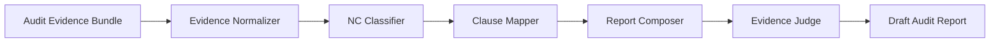

# ISO Audit Report Generator

AI PROJECT FOR GENERATING ISO AUDIT REPORTS.

## Members

- Waramart Kumsatar
- Teeraphat Yodyotee
- Sasikan Saenchanta

## Status

Project initialization

## Progress

- [x] Week 2: Audit Report Schemas 
- [x] Week 3: Evidence Ingest API 
- [ ] Week 4: ISO 27001 Knowledge Base Setup 
- [ ] Week 5: RAG Retrieval Pipeline 
- [ ] Week 6: NC Classifier Agent 
- [ ] Week 7: Report Composer Agent 
- [ ] Week 8: Evidence Judge Agent 
- [ ] Week 9: Frontend UI 
- [ ] Week 10: Report Viewer 
- [ ] Week 11: Export PDF / Markdown 
- [ ] Week 12: Evaluation & Demo Preparation 

## System Architecture

